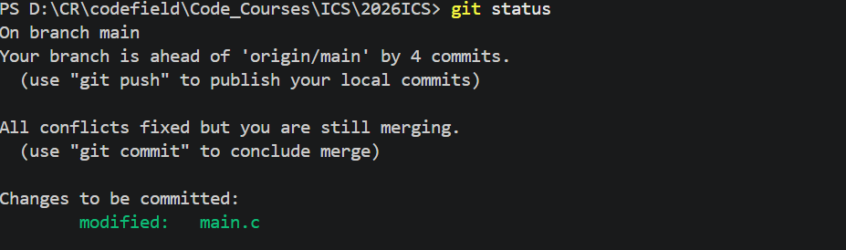

# Lab0: GitLab 实验报告

`2026,9,14 -- 2026,9,15`

## 一、仓库及建立及 Git 安装

_个人小结_~

- github仓库需要设置为public，不然给出链接后非协作者无法访问。
- SSH密钥可以不设置，有多种方式可以克隆仓库到本地。使用http网址。使用SSH密码登录也行。（设置密钥可以免密SSH登录）
- 使用`git commit`命令时，添加`-m`参数可以快速提交评论，无需在vim编辑器中输入
- git在现代开发中是必不可少的，它有助于团队间更好的合作，有利于软件版本的更新迭代。它让开发者可以更方便快捷的进行错误的修复和版本的回退。

## 二、问题回答

### No.1

1. 是否有过多人协同开发经历？如何分工协作？

> 有。需求确定后，会按应用功能进行分工，每人在自己的分支上工作。每人维护自己的分支。
> 在确定功能完好可运行后，在本地分支进行提交和同步。
> 借助github的PR功能，在云端提出合并请求（个人不可在本地直接合并），团队沟通审核后合并。

2. Git 为什么要设计“暂存-提交”两个步骤？

Git 将“暂存”和“提交”分成两个步骤，可以让开发者对自己的提交进行更多审查，减少错误提交的概率。这样可以让每次提交更精确，也便于代码审查和版本管理。

3. `git branch` 和 `git branch -a` 的区别是什么？

`git branch` 默认只显示本地分支，也就是当前仓库中本机已经创建或检出的分支。其中带 `*` 的分支表示当前所在分支。

`git branch -a` 会显示所有分支，包括本地分支和远程跟踪分支。远程分支通常以 `remotes/origin/...` 的形式出现。因此，如果只想查看本地正在维护的分支，可以使用 `git branch`；如果想了解远程仓库中还有哪些分支，或者确认远程分支是否已经被拉取到本地，可以使用 `git branch -a`。

### No.2

- 克隆仓库
  
- 先检查仓库状态
  
- 修改后进行 `commit`。

```c
#include <stdio.h>

int main()
{
    // @TODO: print a sentence you want.
    printf("This is just a test.\n");
    printf("Hello, world!\n");
    return 0;
}
```


_验证_

- `make`需要安装额外软件，在查看 Makefile 文件后，我使用 `gcc` 进行了等价验证；

```bash
gcc -Wall -O2 -o main.exe main.c
.\main.exe
```

- 程序运行输出为：

```text
This is just a test.
Hello, world!
```

### No.3

1. Commit规范

文章介绍了规范化提交信息的重要性，并说明一个清晰的 commit message 通常应包含类型、简短说明和必要的详细描述。常见类型包括 `feat`、`fix`、`docs`、`style`、`refactor`、`test`、`chore` 等。规范的提交信息能够帮助团队快速理解每次修改的目的，也便于自动生成 changelog、回溯问题和进行代码审查。

2. 语义化版本

语义化版本通常采用 `主版本号.次版本号.修订号` 的形式。修订号用于向后兼容的问题修复，次版本号用于向后兼容的新功能，主版本号用于不兼容的 API 修改。语义化版本的意义在于让使用者通过版本号就能大致判断升级风险，从而更好地管理依赖和发布节奏。

3. 为什么要学习 Git？

学习 Git 不只是为了提交代码，更是为了学习一种可靠的项目管理方式。Git 可以记录每一次修改，让开发者知道代码为什么变成现在这样；Git 的分支机制可以让新功能开发、错误修复和稳定版本维护互不干扰；Git 的合并和冲突处理机制也让多人协作变得可控。对于课程作业、个人项目和团队开发来说，Git 都能减少版本混乱，提高协作效率，并保留清晰的开发历史。

### No.4

1. main分支修改

- 检查

```shell
PS D:\CR\codefield\Code_Courses\ICS\2026ICS> git status
On branch main
Your branch is ahead of 'origin/main' by 1 commit.
  (use "git push" to publish your local commits)

Changes not staged for commit:
  (use "git add <file>..." to update what will be committed)
  (use "git restore <file>..." to discard changes in working directory)
        modified:   main.c

Untracked files:
  (use "git add <file>..." to include in what will be committed)
        .gitignore
        report/  # 存放实验报告和相关图片

no changes added to commit (use "git add" and/or "git commit -a")
PS D:\CR\codefield\Code_Courses\ICS\2026ICS>
```

```shell
git add .
git commit -m "update main"
```

2. 创建 `feature` 分支并制造冲突

- 创建新分支 + 制造冲突

```bash
git switch -c feature
```

任意增加一段代码

```c
printf("This line is from the feature branch.\n");
```

提交：

```bash
git add main.c
git commit -m "update on feature"
```

切回 `main` 分支，并修改 `main.c` 中相同位置的同一行

```c
printf("This line is from main branch.\n");
```

提交 `main` 分支上的修改：

```bash
git add main.c
git commit -m "update on main"
```

由于两个分支修改了同一文件的同一位置，之后执行合并时 Git 无法自动判断应该保留哪一版内容，因此会出现合并冲突。

5. 合并分支并解决冲突

`main` 分支上执行：

```bash
git merge feature
```

执行：

```bash
git add main.c
git commit -m "resolve merge conflict in main"
```

至此，`feature` 分支中的修改已经合并到 `main` 分支，冲突也被解决。

`出现合并冲突的截图`


`解决冲突后的截图`


